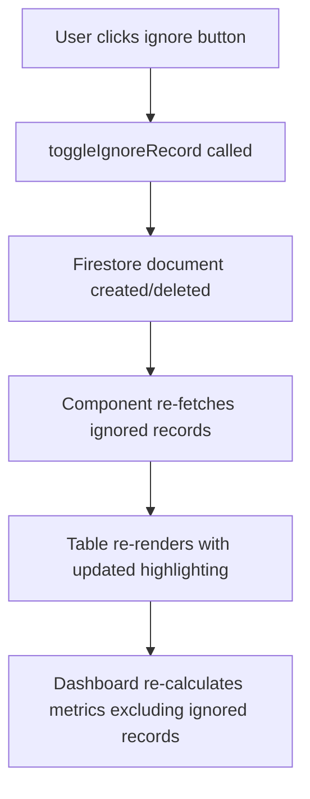

# Add Ignore Records Feature

## Overview

Implements a feature to mark records in data tables as "ignored", excluding them from metric calculations. Ignored records remain visible in tables but are highlighted in red. The ignore state is stored in Firebase Firestore and is global (shared across all users).

## Architecture

### Data Storage

- **Firebase Firestore Collection**: `ignoredRecords`
- **Document ID**: Composite key `{tableType}-{recordId}`
- **Fields**:
  - `tableType`: string (e.g., "stl", "conversion", "pitch", "connection", "grossIssue", "dialsPerHour", "conversionQualified", "conversionUnqualified")
  - `recordId`: string | number (the unique identifier for the record)
  - `ignoredAt`: timestamp
  - `ignoredBy`: string (user ID)

### Record Identification Strategy

- **STL**: Uses `leadId` → composite key: `stl-${leadId}`
- **All others**: Use `id` → composite key: `{tableType}-${id}`
- Handle null/undefined IDs gracefully (cannot be ignored)

## Implementation Steps

### 1. Firebase Firestore Setup

**File**: `lib/firebase.ts`

- Add Firestore import: `getFirestore` from `firebase/firestore`
- Initialize Firestore: `getFirestore(app)`
- Export Firestore instance as `db`

### 2. Ignored Records Service

**New File**: `lib/ignored-records.ts`

- Create service functions:
  - `getIgnoredRecords()`: Fetch all ignored records from Firestore collection
  - `isRecordIgnored(tableType, recordId)`: Check if a specific record is ignored
  - `toggleIgnoreRecord(tableType, recordId, userId)`: Add/remove record from ignored list (creates/deletes Firestore document)
  - `getIgnoredRecordIds(tableType)`: Get all ignored IDs for a specific table type as a Set
- Handle Firestore errors gracefully
- Use composite key format: `{tableType}-{recordId}` for document IDs

### 3. Update Data Table Components

**Files to update** (8 total):

- `components/dashboard/stl-data-table.tsx`
- `components/dashboard/conversion-data-table.tsx`
- `components/dashboard/pitch-data-table.tsx`
- `components/dashboard/connection-data-table.tsx`
- `components/dashboard/gross-issue-data-table.tsx`
- `components/dashboard/dials-per-hour-data-table.tsx`
- `components/dashboard/conversion-qualified-data-table.tsx`
- `components/dashboard/conversion-unqualified-data-table.tsx`

**Changes per component**:

- Import `useAuth` from `@/contexts/auth-context`
- Import ignored records service functions
- Add state to track ignored record IDs for the current table type
- Fetch ignored records on mount using `useEffect`
- Add "Ignore" column header to table
- Add ignore/unignore button to each row (EyeOff/Eye icon from lucide-react)
- Apply red highlighting to ignored rows: `className={isIgnored ? "bg-red-50 dark:bg-red-950/20" : ""}`
- Handle toggle ignore action with loading state
- Disable ignore button for records with null/undefined IDs
- Add tooltip explaining what "ignored" means

### 4. Update Metric Calculations

**File**: `components/dashboard/dashboard-content.tsx`

- Import ignored records service
- Fetch all ignored records at dashboard level (once, not per table)
- Pass ignored record IDs to `transformApiData` function
- Filter data arrays in `transformApiData`:
  - Filter `filteredCalls` to exclude ignored records (for conversion, pitch, connection, grossIssue, dialsPerHour, conversionQualified, conversionUnqualified)
  - Filter `timeFilteredStl` to exclude ignored STL records
- Update all metric calculations to use filtered data
- Pass ignored record IDs to data table components (optional, for consistency)

### 5. UI Components

- Use `EyeOff` icon for ignored state, `Eye` icon for not ignored
- Add tooltip: "Ignore this record (excludes from metrics)"
- Red background: `bg-red-50 dark:bg-red-950/20` for ignored rows
- Button should show current state (ignored vs not ignored)
- Handle loading states when toggling ignore

## Data Flow

## Key Implementation Details

### Table Type Mapping

- `stl` → STLDataTable (uses `leadId`)
- `conversion` → ConversionDataTable (uses `id`)
- `pitch` → PitchDataTable (uses `id`)
- `connection` → ConnectionDataTable (uses `id`)
- `grossIssue` → GrossIssueDataTable (uses `id`)
- `dialsPerHour` → DialsPerHourDataTable (uses `id`)
- `conversionQualified` → ConversionQualifiedDataTable (uses `id`)
- `conversionUnqualified` → ConversionUnqualifiedDataTable (uses `id`)

### Performance Considerations

- Fetch all ignored records once at dashboard level
- Use Set for O(1) lookup when checking if record is ignored
- Batch ignore state checks in data table components

### Error Handling

- Handle Firestore connection errors gracefully
- Show user-friendly error messages
- Allow retry on failed operations

## Testing Checklist

- [ ] Can mark records as ignored in each table type
- [ ] Ignored records show red highlighting
- [ ] Can un-ignore records
- [ ] Ignored records are excluded from metric calculations
- [ ] Ignored state persists after page refresh
- [ ] Multiple users see the same ignored